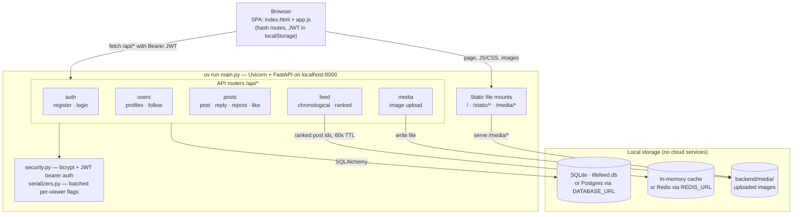
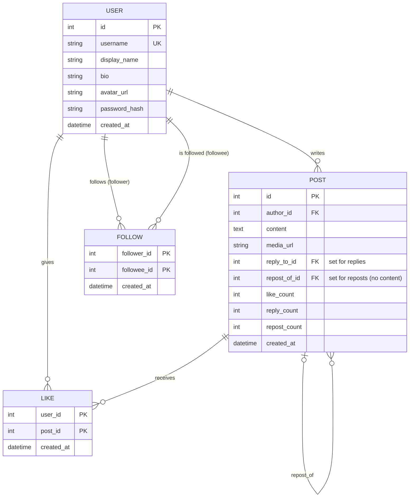
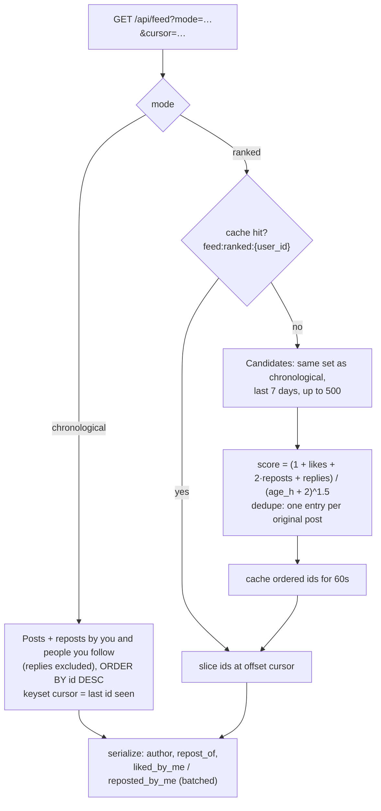

# LifeFeed

A Twitter clone built as a practice project: posts, replies, reposts, likes, follows, a home feed (chronological + ranked), user profiles and image uploads. Everything runs locally. It needs no cloud services and no Docker.

## Quick start

Requires [uv](https://docs.astral.sh/uv/) (it installs Python 3.10 and the dependencies for you).

```bash
cd backend
uv sync                        # install dependencies
uv run python -m app.seed      # optional: demo users + posts (password: password123)
uv run main.py                 # http://127.0.0.1:8000  (add --reload while developing)
```

Open http://127.0.0.1:8000 for the web app, or http://127.0.0.1:8000/docs for the interactive API docs.

Run the tests:

```bash
cd backend && uv run pytest
```

## Stack

| Concern  | Local default                          | Optional swap-in (env var)                   |
|----------|----------------------------------------|----------------------------------------------|
| API      | Python, FastAPI + Uvicorn              |                                              |
| Database | SQLite file `backend/lifefeed.db`      | PostgreSQL: `DATABASE_URL=postgresql+psycopg://…` (`uv sync --extra postgres`) |
| Cache    | In-process memory cache                | Redis: `REDIS_URL=redis://localhost:6379/0` (`uv sync --extra redis`) |
| Media    | Local folder `backend/media/`, served at `/media` | `MEDIA_DIR=/some/path`             |
| Auth     | JWT (HS256), bcrypt password hashes    | `SECRET_KEY=…` (otherwise one is generated into `backend/.secret_key`) |
| Frontend | Vanilla JS single-page app served by FastAPI (no build step) |                    |

## Architecture



### Data model



A **reply** is a post with `reply_to_id` set. A **repost** is a post with `repost_of_id` set and no content, so reposts appear in timelines alongside regular posts. Likes, replies and reposts aimed at a repost go to the original post. Counters are denormalized onto `posts` and updated in the same transaction as the action. Deleting a post also deletes its replies, reposts and likes, through database `ON DELETE CASCADE`.

### How the feeds work



The ranked order is cached, so scrolling through pages stays consistent. Posting, reposting, following and unfollowing clear your cached copy. Posts from other people show up after the 60s TTL expires.

## API overview

| Method | Path | Notes |
|---|---|---|
| POST | `/api/auth/register`, `/api/auth/login` | returns `{access_token, user}` |
| GET | `/api/auth/me` | current user |
| GET | `/api/feed?mode=chronological\|ranked&cursor=` | home feed (auth) |
| GET/POST | `/api/posts` | explore (everyone's latest) / create post or reply |
| GET/DELETE | `/api/posts/{id}` | read / delete your own |
| GET | `/api/posts/{id}/replies`, `/api/posts/{id}/thread` | direct replies / ancestor chain |
| POST/DELETE | `/api/posts/{id}/like`, `/api/posts/{id}/repost` | idempotent toggles |
| GET/PATCH | `/api/users/{username}`, `/api/users/me` | profile / edit your profile |
| POST/DELETE | `/api/users/{username}/follow` | follow / unfollow |
| GET | `/api/users/{username}/posts?replies=`, `/likes`, `/followers`, `/following` | paginated |
| GET | `/api/users?q=`, `/api/users/suggestions` | search / who to follow |
| POST | `/api/media` | multipart image upload (JPEG/PNG/GIF/WebP, ≤5 MB) |

## Project layout

```
backend/
  main.py              entry point (uvicorn)
  app/
    main.py            FastAPI app, routers, static + media mounts
    config.py          env-driven settings with local defaults
    db.py, models.py   SQLAlchemy engine + tables
    security.py        password hashing, JWT, auth dependencies
    cache.py           in-memory / Redis cache
    storage.py         local media storage + validation
    serializers.py     Post → JSON with per-viewer flags
    routers/           auth, users, posts, feed, media
    seed.py            demo data
    static/            the web client (index.html, app.js, style.css)
  tests/               pytest API tests
```
